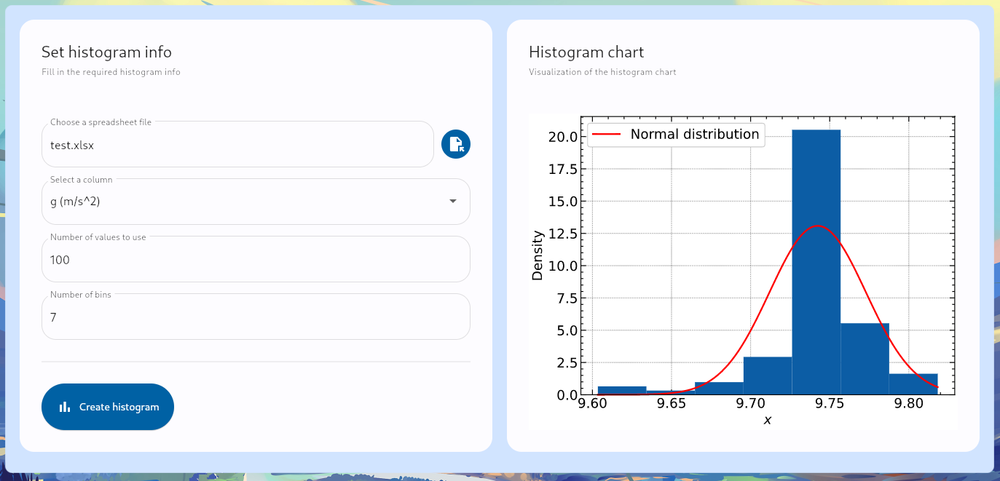

# The Histogram Maker

This is a personal project that started as a way to automate a boring task for
university. Then I realized that so many frameworks already did what I ment to
do. As a result, I've been using it for the past year to test new skills
reguarding coding in general, like making a GUI, design patters, software
architecture and unit testing, to name a few.

## What is does

It is an app, executed via console, that reads a spreadsheet file (Excel,
xlsx) and plots for you a histogram with the normal distribution included.

## Packages used

- matplotlib
- SciencePlots
- numpy
- scipy
- pandas
- xlrd
- openpyxl
- Flet

## Instructions

1. The program already comes with a sample table called **test.xlsx**.

2. Run the Python app the way you prefer, by command line or button inside an
   IDE.

# TODO

1. Make a save figure button;
2. Add error handling in case of user didn't type integers where it's suppose
   to;
3. Make a config file (yaml?);
4. Improove documentation.
